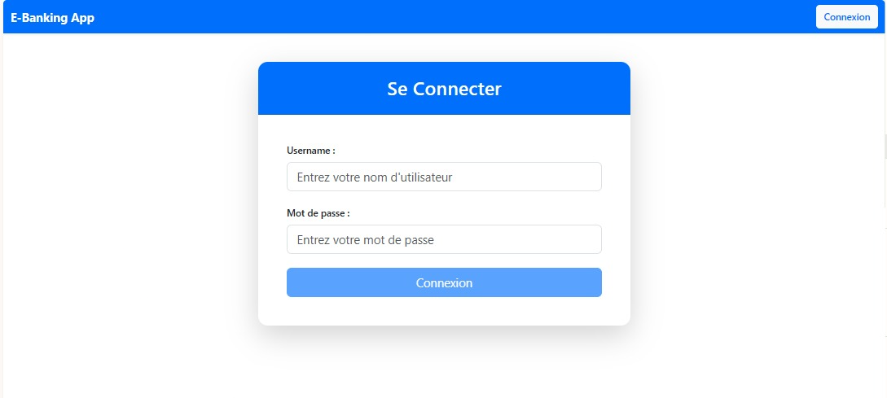
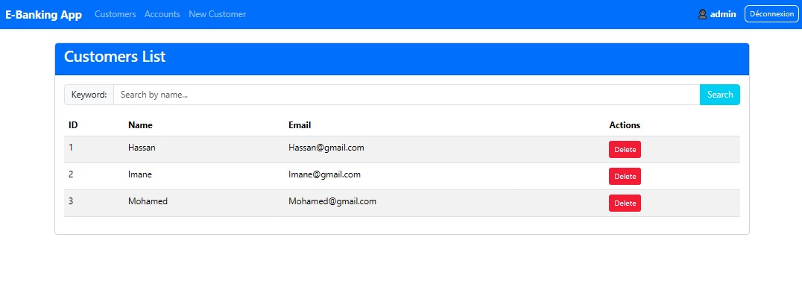
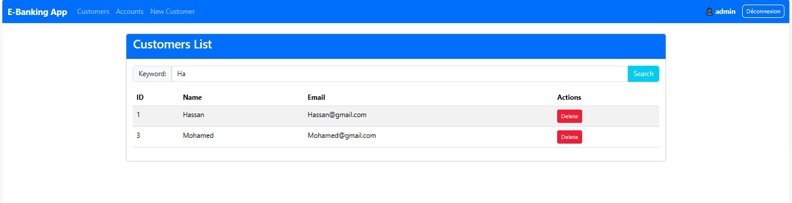
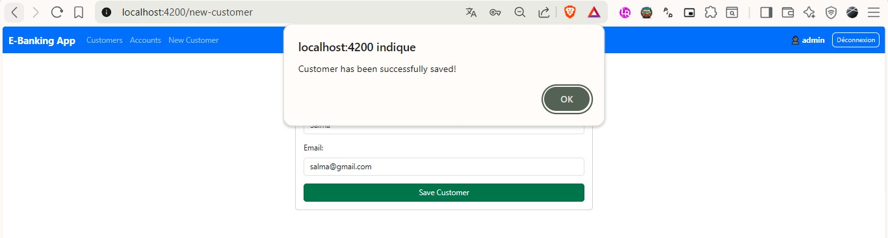
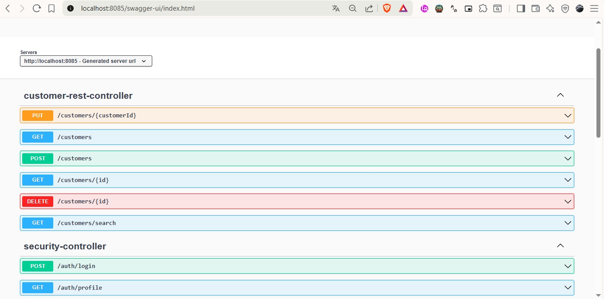

# Digital Banking - Frontend (Angular)

Developed by **Salma Majri** 
*Master SDIA-1 - ENSET Mohammedia*

---

This is the frontend application for the Digital Banking system, developed using Angular. It connects to a Spring Boot backend, manages authentication with JWT tokens, and features dynamic role-based rendering.

##  Key Features Built
* **Dynamic Navbar Integration**: The navbar adaptively displays links (`Customers`, `Accounts`, `New Customer`) based on the user's authentication state and roles (`ROLE_ADMIN` / `ROLE_USER`).
* **Security Interceptor (`AppHttpInterceptor`)**: Automatically intercepts outgoing HTTP requests to append the JWT `Authorization: Bearer <token>` header.
* **State Management & Persistence**: Integrated `AuthService` with `localStorage` to persist session tokens and maintain the user profile on page reloads.
* **Vite & Zone.js Configuration**: Resolved runtime change detection issues by properly configuring `zone.js` within the modern standalone Angular setup.

---

##  Screenshots & Application Flow

### 1. Authentication & Security
The login page provides secure access to the application. In case of API communication issues (such as CORS misconfigurations during initial setup), the application displays appropriate error handling feedback.

| Login Interface | CORS Policy Block (Initial Setup) |
| :---: | :---: |
|  |  |

---

### 2. Customer Management (Admin Panel)
Once authenticated as an administrator, the application unlocks management views. This includes viewing, filtering, and deleting customers dynamically.

#### Customers List View


#### Interactive Live Search (Filtering by Keyword)


---

### 3. Adding New Customers
Administrators can securely save new customer records. The app triggers success notifications upon correct backend API execution.



---

### 4. Backend API Documentation (Swagger UI)
The Angular application consumes secure REST endpoints exposed and documented via Swagger on port `8085`.



---

##  How to Run
1.  Ensure you have Node.js and Angular CLI installed.
2.  Install project dependencies:
    ```bash
    npm install
    ```
3.  Start the development server:
    ```bash
    ng serve
    ```
4.  Open the application at `http://localhost:4200`.
